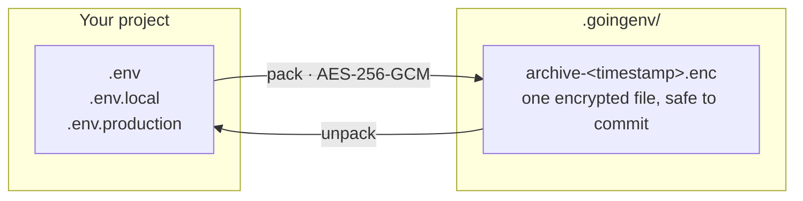

<p align="center">
  <picture>
    <source media="(prefers-color-scheme: dark)" srcset="assets/logo-full.svg">
    <source media="(prefers-color-scheme: light)" srcset="assets/logo-full-light.svg">
    
  </picture>
</p>

<p align="center">
  <a href="https://github.com/spencerjireh/goingenv/actions/workflows/ci.yml"></a>
  <a href="https://github.com/spencerjireh/goingenv/releases/latest"></a>
  <a href="https://github.com/spencerjireh/goingenv/blob/main/LICENSE.md"></a>
  <a href="https://goreportcard.com/report/github.com/spencerjireh/goingenv"></a>
</p>

---

Bundle your `.env` files into one AES-256-GCM encrypted archive, commit it alongside your
code, and let teammates restore it with a shared password. A CLI and a terminal UI over the
same commands.

> [!WARNING]
> **Disclaimer** -- This project was developed with AI assistance and has not undergone a
> formal security audit. Perform your own assessment before using it with sensitive data.

## Install

```bash
curl -sSL https://raw.githubusercontent.com/spencerjireh/goingenv/main/install.sh | bash
```

Linux and macOS, x86_64 and ARM64. On Windows, use
[WSL](https://docs.microsoft.com/en-us/windows/wsl/install). The script verifies the
download against the release checksums and refuses to install if they do not match.

<details>
<summary>Other ways to install</summary>

```bash
# A specific version
curl -sSL https://raw.githubusercontent.com/spencerjireh/goingenv/main/install.sh | bash -s -- --version <tag>
```

**Manual:** download a binary from [releases](https://github.com/spencerjireh/goingenv/releases), extract it, and move it onto your `PATH`.
**From source:** needs Go 1.26 or newer. `go build ./cmd/goingenv`.

More installer flags: [usage guide](docs/usage.md#install-options).

</details>

## Usage

```bash
goingenv init                # Create .goingenv/ in your project
goingenv                     # Launch the terminal UI
goingenv status              # See which files would be packed
goingenv pack                # Encrypt them into .goingenv/archive-<timestamp>.enc
goingenv unpack              # Decrypt the newest archive and restore its files
goingenv list                # Inspect an archive without extracting
goingenv diff                # Which keys changed since the last pack (values never shown)
goingenv run -- npm start    # Run a command with the archive's variables, nothing on disk
```



The password is never stored. Share it through a channel that is not the repository.

One shared password opens an archive: everyone on the team holds the same
secret, and removing someone means re-packing under a new one. That is the
trade for having no keys to manage; [SECURITY.md](SECURITY.md) spells out what
it does and does not protect.

## Commands

| Command | Description |
|---|---|
| `goingenv` | Launch the terminal UI |
| `goingenv init` | Set up `.goingenv/` in the current project |
| `goingenv init --project-config` | Also write a committed `.goingenv/config.json` |
| `goingenv pack` | Encrypt env files into an archive |
| `goingenv unpack` | Decrypt an archive and restore files |
| `goingenv list` | Show an archive's contents |
| `goingenv diff` | Show which keys differ between archives, or an archive and the working tree |
| `goingenv run -- CMD` | Run a command with an archive's variables in its environment |
| `goingenv status` | Show detected files and existing archives |

Every command takes `--format` -- `text` (default), `json`, `porcelain`, plus
`csv` for `list`. See the [usage guide](docs/usage.md#output-formats).

## Documentation

- [Usage Guide](docs/usage.md) -- output formats and scripting, file selection, configuration
- [Security Guide](SECURITY.md) -- threat model, encryption details, verifying a download
- [Developer Guide](docs/development.md) -- building, testing, CI, contributing
- [Design System](docs/design.md) -- brand, TUI specs, CLI output design
- [Website](https://spencerjireh.github.io/goingenv/)

## License

[MIT](LICENSE.md)
